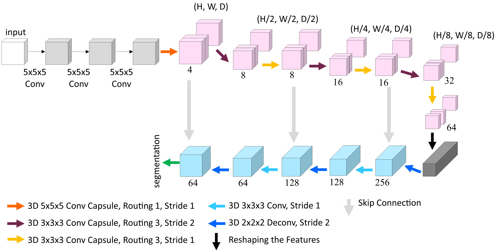

A Modified version of 3D-UCaps

# Volumetric Macromolecule Identification in Cryo-Electron Tomograms using 3D Capsule Networks (3D-UCaps)

we employ capsule-based architecture to automate the task of macromolecule identification, that we refer to as 3D-UCaps. 3D-UCaps is a voxel-based Capsule network for medical image segmentation. In particular, the architecture is composed of three components: feature extractor, capsule encoder, and CNN decoder. The feature extractor converts voxel intensities of input sub-tomograms to activities of local features. The encoder is a 3D Capsule Network (CapsNet) that takes local features to generate a low-dimensional representation of the input. Then, a 3D CNN decoder reconstructs the sub-tomograms from the given representation by upsampling.



Details of the 3D-UCaps model architecture can be found here [following paper](https://rdcu.be/cyhMv):

```
Hajarolasvadi, N., Sunkara, V., Khavnekar, S. et al. Volumetric macromolecule identification in cryo-electron 
tomograms using capsule networks. BMC Bioinformatics 23, 360 (2022). https://doi.org/10.1186/s12859-022-04901-w
```

### Installation
Please visit: https://github.com/VinAIResearch/3D-UCaps.git
```

